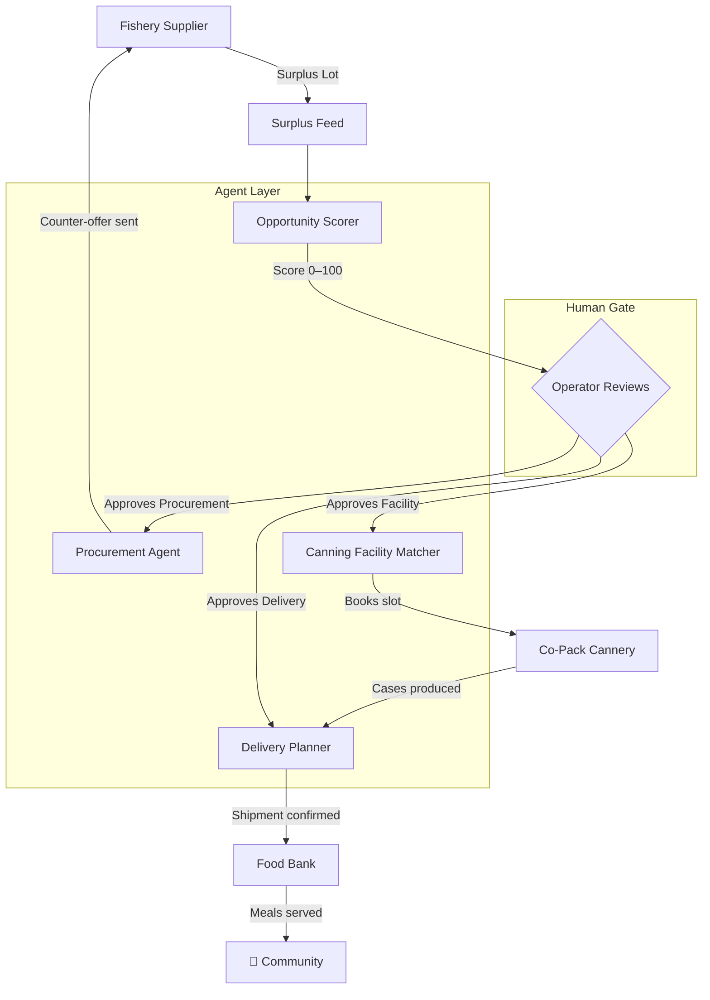

# 🌊 TideLift

**Surplus local fisheries → shelf-stable canned seafood → food banks.**

> *Agent recommends. You decide.*

TideLift is an AI-assisted supply chain platform that identifies surplus fish lots, scores procurement opportunities, matches canning facilities, plans deliveries to food banks, and gates every commitment behind human approval.

---

## Architecture



---

## Project Structure

```
FoodBank-Hack/
├── apps/
│   ├── agents/          # Agent logic (scorer, procure, canning, route, approvals, pipeline)
│   └── web/             # SvelteKit app (UI + API routes)
│       ├── src/
│       │   ├── lib/     # store, impactMetrics, validation, components
│       │   └── routes/  # pages + API endpoints
│       └── ...
├── packages/
│   └── shared/src/      # types, mockData, demoScenario
├── Dockerfile
├── docker-compose.yml
└── .env.example
```

---

## Setup

### Prerequisites
- Node.js 20+
- npm 10+

### Install

```bash
git clone https://github.com/kenadams1990/FoodBank-Hack.git
cd FoodBank-Hack
npm install
```

### Run development server

```bash
cd apps/web
npm run dev
```

Open [http://localhost:5173](http://localhost:5173)

### Run with Docker

```bash
cp .env.example .env
docker-compose up --build
```

Open [http://localhost:3000](http://localhost:3000)

---

## Demo Walkthrough

1. Open the app and navigate to **Demo Run** in the nav
2. Click **▶ Run Demo** — the pipeline runs step-by-step:
   - Lot `lot-003` (2,100 lbs wild salmon) is scored: **91/100**
   - Procurement draft created at **$2.10/lb** (40% off market)
   - Operator approves procurement → lot advances to `PROCUREMENT_CONFIRMED`
   - Bay Area Cannery matched and booked
   - Delivery plan assigns cases to Alameda County and SF-Marin food banks
   - Impact metrics update live
3. Navigate to **Logistics Board** to see the lot move through Kanban columns
4. Click any lot card to see the **Lot Detail + Recommendation Panel**
5. Visit **Partners** to browse the supplier and food bank directory

---

## API Endpoints

| Method | Path | Description |
|--------|------|-------------|
| GET | `/api/lots` | List lots (filter: species, status, minScore, maxScore) |
| POST | `/api/lots/:id/score` | Score a lot |
| GET | `/api/recommendations/:lotId` | Full agent bundle |
| GET/POST | `/api/approvals` | List or create approvals |
| PATCH | `/api/approvals/:id` | Approve or reject (idempotent) |
| GET | `/api/shipments` | Logistics board data |
| GET | `/api/partners` | Supplier + food bank directory |
| GET | `/api/audit` | Paginated audit log |

---

## Impact Metrics

Calculated from all non-expired, non-available lots:

| Metric | Formula |
|--------|---------|
| Food Rescued | Sum of lot `lbs` |
| Cans Produced | `lbs × 1.8` (14.75 oz cans) |
| Cost Avoided | `lbs × (marketPrice − actualPrice)` per lot |
| Meals Estimated | 1 can = 1 meal |

---

## Environment Variables

See [`.env.example`](.env.example) for all required variables.

---

## Running Tests

```bash
cd apps/agents
npx vitest run
```

---

*Built for AI Supply Chain Hackathon 2026 • TATinc.us*
