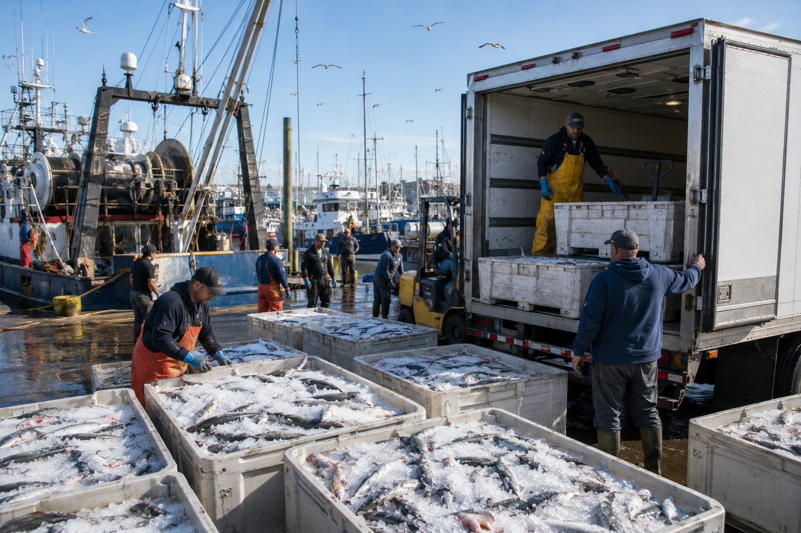
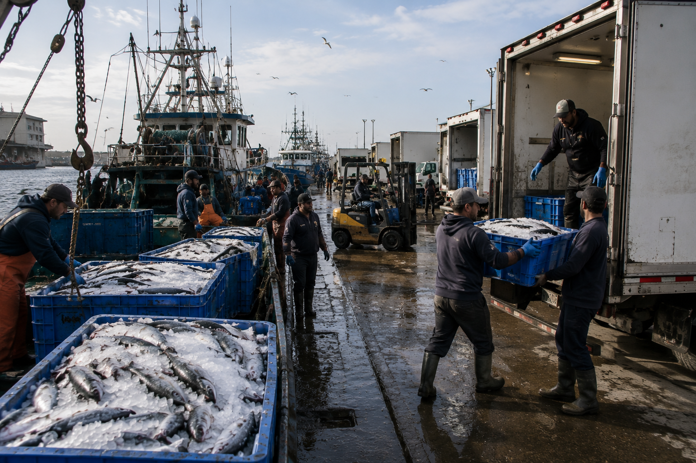

# 🌊 TideLift AI

<p align="center">
  
</p>

> **Surplus local fisheries → shelf-stable canned seafood for food banks.**
> A multi-agent AI platform that scores surplus catch, drafts procurement terms, matches canning facilities,
> and routes finished product to food banks — with a human approving every step.
>
> **Agent recommends. You decide.** Every agent output is a draft with a reason attached — quantity, price,
> route, partner. A human operator approves before anything executes, and every approval is logged to an
> audit trail.

[](https://github.com/kenadams1990/FoodBank-Hack)
[](https://tidelift.tatinc.us)
[](https://github.com/kenadams1990/FoodBank-Hack)

---

## ▶️ Live Demo

**[tidelift.tatinc.us](https://tidelift.tatinc.us)** — two ways in:

| Entry point | What it is |
|---|---|
| **[/guided-demo](https://tidelift.tatinc.us/guided-demo)** | A self-running, narrated walkthrough of the full pipeline — no clicking required |
| **[/intake](https://tidelift.tatinc.us/intake)** | **Hands-on, working prototype.** Run the real agent pipeline yourself on a logged catch — score → procurement counter-offer → facility match → equity route — and approve or reject the result. Every decision writes to the audit trail. |

A screen-recorded backup walkthrough is also in the repo in case the live site is unreachable:
[`apps/web/static/media/guided-demo/videos/Webpage-demo-slowed.mp4`](apps/web/static/media/guided-demo/videos/Webpage-demo-slowed.mp4).

**Honesty note:** on-vessel computer-vision catch counts and thermal readings shown in the demo are labeled
*Simulated — trained fish-scan model is roadmap*. Scoring, procurement drafting, facility matching, and
equity routing are the real agent logic running live, not mocked for the demo.

---

## 🎯 Current Build Focus: Vessel → Pickup → Processing

Per guidance from onsite industry advisors, the team prioritized **the segment between the fishing vessel
and canning/processing intake** — the highest-signal, least-solved gap in the pipeline. This is now a real,
interactive flow at `/intake`, not a mockup:

1. **On-vessel catch logging** — computer vision at the point of harvest captures quantity, size, and
   species *before* the pickup truck is dispatched, so the purchase/segregation decision is made with real
   data instead of a phone call. *(Simulated in the current build — see honesty note above.)*
2. **Cold-transport dispatch** — the agent pipeline scores the lot, drafts a procurement counter-offer, and
   routes it, all before a truck rolls.
3. **Dockside CV sort** — species and size graded into barcoded, reusable, easy-clean bins, shellfish kept
   separate from fin fish from the first touch.
4. **Thermal-camera surface temperature profiling** at intake, flagging any bin that's drifted out of range
   (>4°C cold-chain threshold).
5. **Chem/microbiological QA flags** — before *and* after processing, not just at the loading dock.
6. **Full cold-chain custody and traceability** — every bin's location, temperature, and handler logged from
   vessel to processor.

An operator can run this pipeline end-to-end today at `/intake`: **Approve** advances the lot to
`PROCUREMENT_CONFIRMED` and schedules an ACCFB shipment; sub-500 lb catches take an honest **HOLD** path
instead of being force-fit into a shipment. The procurement/canning/routing agents below remain part of the
full vision and are already built out — this segment is the current milestone. **Agent recommends. You
decide** — every CV read, temperature flag, and QA hold is a recommendation an operator confirms, not an
automatic action.

---

## The Problem We're Solving

**53 million Americans** visit food banks — 1 in 6. Yet every day, **millions of pounds of surplus seafood**
from local fisheries spoil or get discarded because the cold chain is too expensive, too fragile, and too
perishable to reach those who need it most.

Frozen dies. Canned travels.

The missing piece isn't the fish — it's the **complete AI agent system** that handles everything end-to-end:
finding and contacting fishery suppliers (who have no web presence or public contact info), drafting
procurement terms, securing canning facility partnerships, managing the full repack pipeline, and routing
shelf-stable protein to food banks that have no supplier relationships and no budget for a supply chain
team. Agents draft every step. A human operator approves each one.

That's TideLift. Not a dashboard. Not a tool. A **complete operational system** — with a person in the loop
at every decision point.

<p align="center">
  
</p>

---

## Why This Is a New Category

Most food bank tech stops at inventory management. TideLift starts *before* the fish is caught.

The original insight was simple: **frozen seafood has perishability risk** — a single power outage or
logistics delay destroys the product and the relationship. The solution was to eliminate the cold chain
entirely by targeting the canning step. But that created a harder problem: **no one had the supplier
contacts, the canning facility relationships, or the negotiation bandwidth** to make it work at scale.

TideLift's agents solve all three — drafting continuously, at a cost food banks can actually afford — but
never acting alone. **Agent recommends. You decide.**

---

## How It Works

TideLift is a **multi-agent Operations Intelligence Hub** built around specialized AI agents that work in
concert — from on-vessel catch to food bank shelf. Every arrow below is a *draft*, not an action: an
operator approves each handoff before it executes.

```
🎣 Vessel Intake              🏭 Canning Partner           🏦 Food Bank Shelf
     │                              │                              │
     ▼                              ▼                              ▼
┌──────────┐  draft terms  ┌──────────────┐  draft route     ┌──────────────┐
│  INTAKE  │──────────────▶│  PROCURE &   │─────────────────▶│   EQUITY     │
│  AGENT   │  (→ approve)  │  CAN AGENT   │   (→ approve)    │  ROUTER      │
└──────────┘               └──────────────┘                  └──────────────┘
     │                                                               │
     └──────────────────── ANALYST AGENT ───────────────────────────┘
                           (NL Q&A, briefs, dashboards)
```

### The Agents

Every agent below drafts a recommendation with a reason. Nothing executes until a human clicks approve —
logged to the audit trail either way.

| Agent | Role | Themes Covered |
|-------|------|----------------|
| 🚢 **Intake Agent** | On-vessel CV catch metrics drive the dispatch decision; dockside sort into barcoded bins; thermal-cam QA at >4°C | Current milestone — vessel → pickup → processing |
| 🔭 **Forecast Agent** | Reads harvest calendars + inbound history to predict surplus windows, price dips, and supply gaps 2+ weeks early | Theme 1 — See It Coming |
| 🤝 **Procurement Agent** | Finds fishery supplier contacts, drafts volume-discount terms, books canning facility slots, prepares POs for approval — no Rolodex required | Theme 3 — Production Is Manufacturing |
| 🏭 **Canning Ops Agent** | Treats repack as a factory line — forecasts kit needs, stages raw material, predicts volunteer turnout, sequences the floor | Theme 3 — Production Is Manufacturing |
| 🚚 **Equity Router** | Drafts routes on access windows + dietary need, not just miles; re-proposes routes in minutes when a truck goes down | Theme 4 — Equity With a Truck Attached |
| 📊 **Analyst Agent** | Answers plain-language questions from anyone on the team — no SQL, no tickets; briefs every lead at shift start | Theme 6 — Every Team Member an Analyst |

---

## The Full Pipeline — End to End

TideLift covers every step a human team would otherwise need to coordinate manually:

1. **Vessel intake** — Intake Agent scores the logged catch and flags cold-chain risk before the truck rolls
2. **Supplier outreach** — Procurement Agent finds contacts for local fisheries (no public directory needed)
3. **Discount drafting** — Agent proposes pricing and volume terms; an operator approves before anything is committed
4. **Canning facility booking** — Procurement Agent identifies co-packing partners and drafts booking requests
5. **Canning ops management** — Canning Ops Agent manages the floor: staging, sequencing, volunteer scheduling
6. **Finished goods routing** — Equity Router proposes delivery by access window, dietary need, and urgency; operator confirms
7. **Continuous reporting** — Analyst Agent keeps every stakeholder informed in plain language

This is the pipeline that didn't exist. Food banks had no way to work with local fisheries at scale because
the middle steps — contact finding, negotiation, canning logistics — required a full supply chain team.
TideLift *is* that team, with every recommendation surfaced for a human to approve, never a black box
acting on its own.

---

## Alameda County Food Bank — Build List Coverage

TideLift directly addresses **Alameda County Food Bank's 35-item Operations Intelligence Hub** request
across all 7 challenge themes:

### ✅ Theme 1 — See It Coming
- Produce/fish surplus forecast off harvest calendars and inbound history
- Vendor scoring on delivered vs. committed performance
- Price window flagging for purchased food before prices move

### ✅ Theme 3 — Production Is Manufacturing
- Canning line treated as a repack factory — box/kit forecasting weeks out
- Volunteer turnout prediction and no-show risk flagging
- Raw material staging generated the night before, by station, in order

### ✅ Theme 4 — Equity With a Truck Attached
- Routing on agency **access windows** and product urgency, not just miles
- EV charging schedules matched to tomorrow's routes and daytime power cap
- Route rebuild in minutes when a truck goes down or agency cancels

### ✅ Theme 5 — Need Is the Demand Signal
- Dietary preference matching: inbound seafood matched to neighborhood nutrition needs
- Pull-based replenishment replacing pre-allocation guesswork

### ✅ Theme 6 — Every Team Member an Analyst
- Natural language Q&A for drivers, receivers, and warehouse floor staff
- Shift-start briefs: what's inbound, what's at risk, what changed overnight
- Voice note → structured proposal pipeline

### ✅ Theme 7 — A Smarter Movement
- Cross-food-bank surplus matching before product ages out
- Anonymized benchmark data shared across the network

---

## Core Insight: Why Canning?

> *"Frozen has perishability — which is exactly the vulnerability we needed to eliminate."*

| | Frozen | Canned (TideLift) |
|---|---|---|
| **Cold Chain Required** | Yes — costly, fragile | ❌ None |
| **Shelf Life** | ~3–6 months | 2–5 years |
| **Distribution Reach** | Urban hubs only | Rural, remote, any pantry |
| **Waste Risk** | High (power outages, transport) | Near zero |
| **AI Draftability** | Low — spot market | ✅ Contractable, forecastable |
| **Supplier Discovery** | Manual outreach required | ✅ Agent-drafted, human-approved |

Canning transforms a volatile, time-sensitive commodity into a **predictable, distributable asset** —
exactly what food bank supply chains need. And because agents draft supplier discovery and procurement
terms for a human to approve, food banks don't need existing fishery relationships to start.

---

## Tech Stack

```
Frontend:     SvelteKit 4 (real-time dashboard, vessel intake, logistics kanban, audit trail)
Deploy:       Cloudflare Pages (adapter-cloudflare), KV-backed store
Agents:       TypeScript modules — intake, score, draft-procure, match facility, route, analyze
Backend:      TypeScript / Node.js, pnpm workspace, CI-tested (vitest)
Data:         Harvest calendars, USDC fishery data, inbound history APIs
AI:           LLM-powered drafting, supplier discovery, and NL Q&A — human approves every output
```

### Repo Structure

```
/
├── apps/
│   ├── web/          # SvelteKit dashboard — vessel intake, kanban, partners, audit trail, approvals API
│   └── agents/       # Agent modules: intake, scorer, procure, canning, route, analyst + vitest tests
├── packages/
│   └── shared/       # @tidelift/shared — shared types, schemas, mock data
└── docs/
    ├── PITCH.md            # Deck and one-pager
    ├── ARCHITECTURE.md     # Agent flow diagrams
    ├── DEMO_SCRIPT.md      # Demo script and walkthrough
    └── ACCFB_NUMBERS.md    # Quantified ACCFB problem/solution figures
```

---

## Quick Start

```bash
# Install dependencies (pnpm workspace — see pnpm-workspace.yaml)
pnpm install

# Run the dashboard
pnpm --filter web dev

# Run agent tests
pnpm --filter agents test
```

---

## The Stakes

- 🐟 **US fisheries discard millions of tons** of bycatch and surplus annually
- 🥫 **Canned seafood is one of the most requested** but least donated food bank items
- 📋 **No supplier directory exists** — food banks can't find fisheries, fisheries can't find food banks
- 🤖 **No AI system currently exists** to draft the fishery → procurement → canning → food bank pipeline end-to-end for a human to approve
- 💰 **$2,500 First Prize** — AISCO Hackathon 2026 (Judging: July 17, Capgemini)

---

## Judging Criteria Alignment

| Criterion | TideLift's Answer |
|-----------|------------------|
| **Solves a real problem** | Directly from ACFB's 35-item build list + field research |
| **AI agent-driven** | Specialized agents with defined roles and handoffs, running live at `/intake` |
| **Quantifiable impact** | Surplus fish → shelf-stable protein, cold chain eliminated, 2–5yr shelf life |
| **Human in the loop** | **Agent recommends. You decide.** Every draft carries a reason; an operator approves before execution; every approval is logged to the audit trail |
| **Built for Alameda County** | All 7 themes addressed, ACFB operations specifically modeled |
| **Complete system** | Vessel intake + procurement drafting + canning logistics + routing — not just a dashboard |

---

## Team

Built at the **AI Supply Chain Observatory Hackathon 2026** — Food Banks + AI
Hosted by the AI Objectives Institute (AOI)
July 15–17, 2026 | Pebblebed → Capgemini

---

*TideLift — because the tide lifts all boats, and every neighbor deserves protein on the shelf.*
