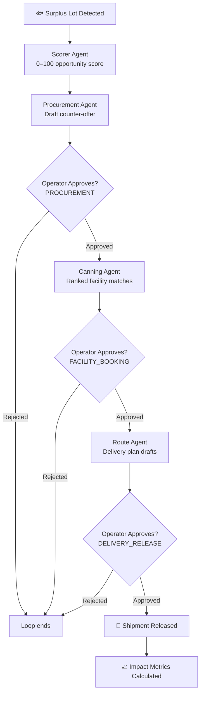

# TideLift

**Surplus local fisheries → shelf-stable canned seafood → food banks.**

> _Agent recommends. You decide._

AI Supply Chain Hackathon 2026 · Built by Ken Adams @ TAT Inc

---

## Architecture



---

## Stack

| Layer | Tech |
|---|---|
| Frontend | SvelteKit + Tailwind CSS |
| Agents | TypeScript pure functions |
| API | SvelteKit server routes |
| State | In-memory store (demo) / PostgreSQL (prod) |
| Tests | Vitest |
| Deploy | Docker + docker-compose |

---

## Monorepo Layout

```
FoodBank-Hack/
├── apps/
│   ├── agents/           # All agent logic (scorer, procure, canning, route, pipeline, approvals)
│   │   └── __tests__/    # Vitest unit tests
│   └── web/              # SvelteKit app
│       ├── src/
│       │   ├── routes/   # Pages + API endpoints
│       │   └── lib/      # Store, validation, metrics, components
│       └── package.json
├── packages/
│   └── shared/           # Types + seed data (used by both agents and web)
├── Dockerfile
├── docker-compose.yml
├── .env.example
└── README.md
```

---

## Setup

```bash
# 1. Clone
git clone https://github.com/kenadams1990/FoodBank-Hack.git
cd FoodBank-Hack

# 2. Install
npm install

# 3. Run web app (demo mode — no DB required)
cd apps/web && npm run dev

# 4. Open
open http://localhost:5173
```

---

## Demo Walkthrough

1. Open **Dashboard** — see 8 surplus lots with live status badges
2. Click any `AVAILABLE` lot → hit **Score This Lot** → see the 0–100 breakdown
3. Scroll to **Agent Recommendations** — three panels: Procurement, Facility, Delivery
4. Each panel shows the agent’s draft and **Approve / Reject** buttons
5. Approve all three → lot advances through the kanban
6. Check **Logistics Board** → see the lot move columns in real time
7. Visit **Demo Run** → hit ▶ to watch the full pipeline animate step-by-step with impact metrics

---

## Running Tests

```bash
cd apps/agents
npx vitest run
```

---

## Docker Deploy

```bash
docker-compose up --build
# App: http://localhost:3000
# Postgres: localhost:5432
```

---

## Impact Metrics

| Metric | Calculation |
|---|---|
| Food Rescued | Sum of lbs from confirmed+ lots |
| Cans Produced | `lbs × 0.88 yield ÷ 0.55 lbs/can` |
| Meals Estimated | 1 can = 1 meal (400g baseline) |
| Cost Avoided | `(market − purchase price) × lbs` |

---

## Design Principle

The agent pipeline scores, drafts, and recommends. Every procurement commitment, facility booking, and delivery release requires explicit operator approval before any state change occurs. No money moves, no facility is booked, no shipment releases without a human in the loop.
